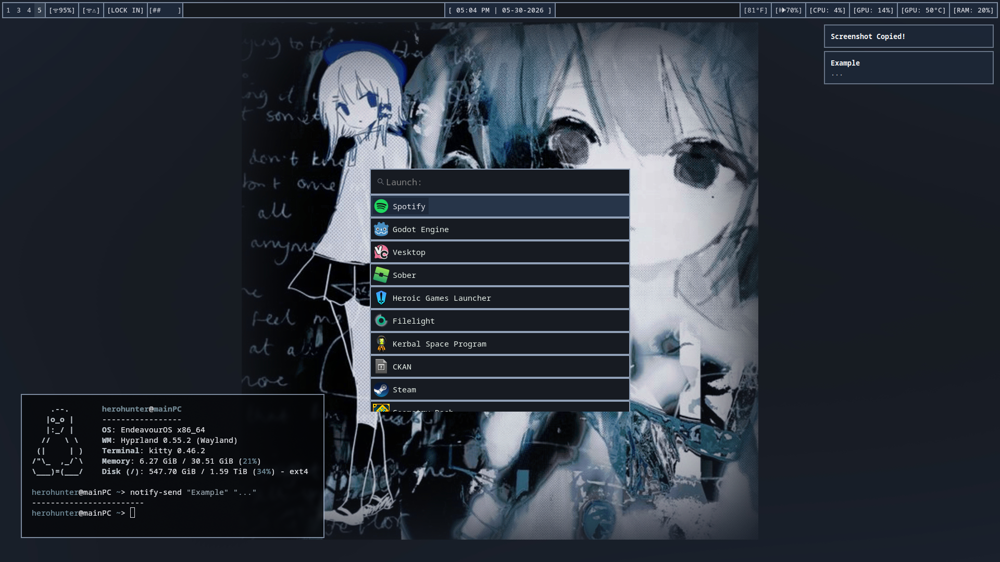

# HyprBreakcore Rice [Hyprland] 
An EndeavourOS & Hyprland rice based around the breakcore aesthetic (both the music and art). 

Since EndeavourOS is Arch based, this should also all work on Arch, however I cannot guarentee everything will work as intended on other distros. **Keep in mind this started as just a place for me to backup my own files, and not everything is setup for someone else to *easily* copy paste!** 

I think this repo is missing some stuff, and other things may only work on my computer, or require other setup. 
This does not include my GTK-3 theme.

You can see an example image of how this rice might look below:  

**This showcase image may not always be fully updated**, but still reflects the general appearance of the rice.

The background can be found at [/images/BackgroundImage.jpg](images/BackgroundImage.jpg) (obviously). The art is the cover of *Posttraumatic stress disorder/幻想を壊す/alternative/breakcore/EDM* by C:/18hzr/breakcore, and I formatted it to look good at 16:9.

This has some weird things, like the *LOCK IN* button and wifi reset button, which only apply to me and are probably useless (and/or won't work) for others.
Alongside those, I also have some random scripts mixed in the /scripts folder that may not apply. Yes, I know many of the scripts are bad, I'm still a beginner at bash and Linux. 

Every config that references a script in /scripts is within *~/Everything/scripts* on my computer. If you want to use some of these scripts then you may need to adjust the location of the script being used in config files. 

This same rice is listed on [Awesome Dotfiles!](https://awesome-dotfiles.vercel.app/rice/raylee)
